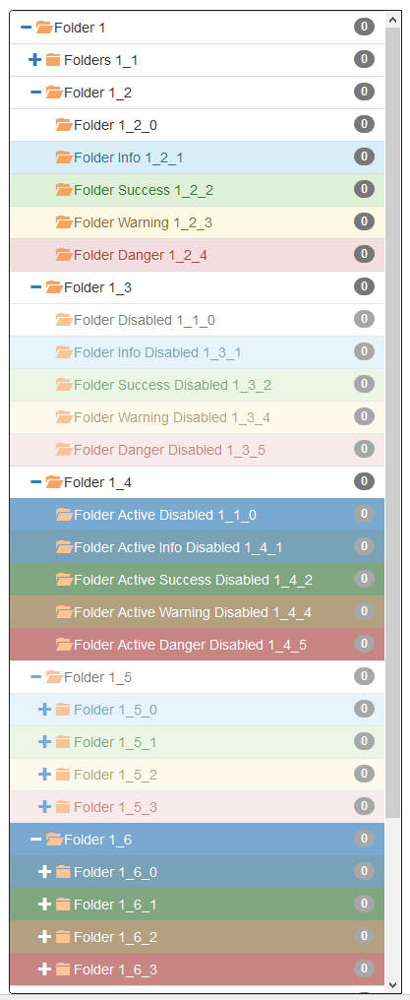

# BOOTSTRAP-TREECSS : A full bootstrap css implementation for tree data structure

[](https://www.npmjs.com/package/bootstrap-treecss)
[](https://travis-ci.org/hhdevelopment/bootstrap-treecss)

## Demo 

[Demo](http://hhdev.fr/bootstrap-csstree/index.html#)

## How do I get set up? 

### Summary of set up
Tree.css is based on bootstrap features.  
So add bootstrap.js, bootrap-theme.js, jquery.js.  
Optionnaly add fonts from boostrap.    
Of course you can use your favorite dependency manager, bower or npm and your favorute packager like webpack.    
Treecss is only css so no probleme for packaging.  

Finally add tree.css to your project  

### Install 
Use npm  
```sh
npm install bootstrap-csstree --save  
```

Include css in your build  

```sh
node_modules/bootstrap-csstree/dist/bootstrap-csstree.css
```



### Configuration

In your index.html  

* Add bootstrap-csstree.css directly or from you dependencies tools (npm, webpack, gulp, etc...)

```html
<!DOCTYPE html>
<html ng-app="tree-demo">
	<head>
		...
		<link rel="stylesheet" href="bootstrap-csstree.css">
		...
```

* Add root tree

```html
<div class="tree">
	<span ng-repeat="folder in ctrl.folders track by $index" ng-include="'tree-template.html'"></span>
</div>
```

See class tree  
Here we use recursive template tree-template.html  

**See classes for style tree :**  

* class **disabled**  

* Define items template 
**** tree-template.html

```html
<span>
	<div ng-class="{'active':ctrl.selectedFolderIds.includes(folder.id) || folder.active, 
							'tree-item-info':folder.info, 
							'tree-item-success':folder.success, 
							'tree-item-warning':folder.warning, 
							'tree-item-danger':folder.danger, 
							'disabled':folder.disabled}" 
			class="tree-item"> 
		<span ng-click="ctrl.handlerSelectFolder($event, folder)">
			<a href data-toggle="collapse" data-target="#folder{{folder.id}}">
				<i open notselect ng-class="{'invisible':!folder.folders || !folder.folders.length}" class="glyphicon glyphicon-minus"></i>
				<i open notselect class="glyphicon glyphicon-folder-open"></i>
				<i close notselect class="glyphicon glyphicon-plus"></i>
				<i close notselect class="glyphicon glyphicon-folder-close"></i>
			</a>
			<span class="badge" ng-bind="0"></span>
			{{folder.label}} {{folder.id}}
 		</span>
	</div>
	<div ng-if="folder.folders && folder.folders.length" class="tree-children collapse in" id="folder{{folder.id}}">
		<span ng-repeat="folder in folder.folders track by $index" ng-include="'tree-template.html'"></span>
	</div>
</span>
```

**See main class**  

* class **tree-item**

**See classes for style tree-item :**  

* class **tree-item-success**  
* class **tree-item-info**  
* class **tree-item-warning**   
* class **tree-item-danger**  
* class **active**  
* class **disabled**  

**See for collapse, folde, expande icons :**  

* atttribute **open**  
* atttribute **close**  

Add **noselect** on node that not select item  
Add **data-toggle** and **data-target** for use boostrap feature collapse in and out    

**See classes :**  

* tree-childen  
* collapse  
* in : treechildren will be open  

### In js add click handler
Example in angular 1

```js
var ctrl = this;
ctrl.folders = [];
ctrl.handlerSelectFolder = handlerSelectFolder;
ctrl.selectedFolderIds = [];

/**
 * folder selection 
 * @param {type} event
 * @param {type} folder
 */
function handlerSelectFolder(event, folder) {
	if(!event.target.hasAttribute("notselect") && !folder.disabled) {
		if(!event.ctrlKey) {
			ctrl.selectedFolderIds = [folder.id];
		} else {
			var idx = ctrl.selectedFolderIds.indexOf(folder.id);
			if(idx !== -1) {
				ctrl.selectedFolderIds.splice(idx, 1);
			} else {
				ctrl.selectedFolderIds.push(folder.id);
			}
		}
	}
}
```

Function handlerSelectFolder can be use for standard use. ctrl key press for multi select, etc...